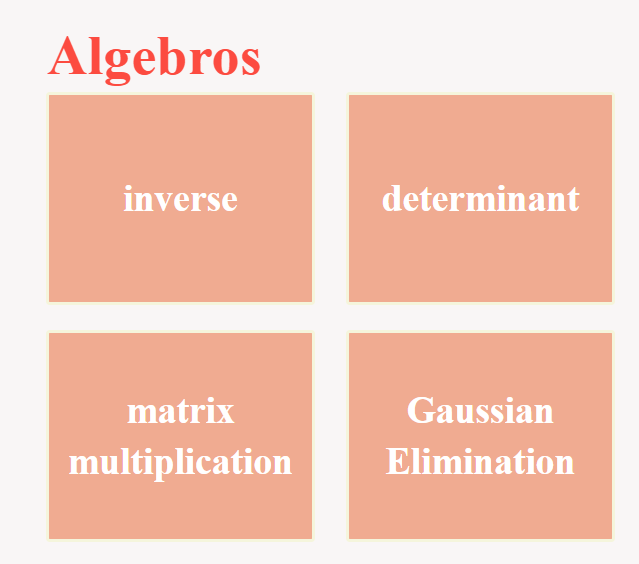
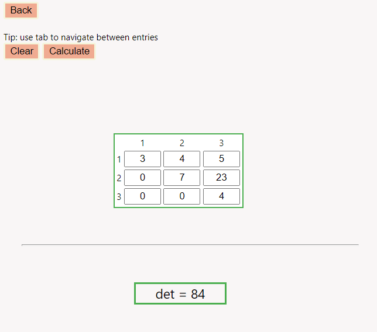

# HTN
Hack the North 2021 Project

We're building a Chrome extension that can allow you to quickly calculate some common linear algebra functions, like deteterminants and inverses.

### Main Page:

### Determinant Calculator
